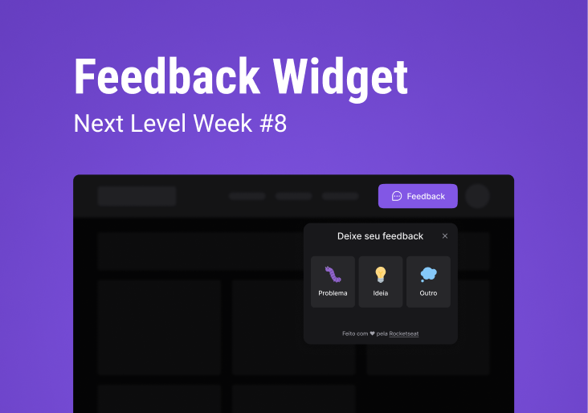

<h1 align="center" style="font-size:3.4rem">Next Level Week #8<h1>

<h1 align="center">
 
</h1>

<h2 align="center">
<a href="#about">About</a>  |
<a href="#status">Status</a>  |
<!-- <a href="#preview">Preview</a>  | -->
<a href="#features">Features</a>  |
<a href="#technologies">Technologies</a>  |
<a href="#contribute">Contribute</a>  | 
</h2>

<h2 id="about">🏷 About The Project</h2>

Trilha Impulse do Evento Next Level Week Return com a criação de um componente Widget com a função de feedback.

<h2 id="status"> 🚦 Status </h2>
<h4 align="center"> 
	🚧  Feedback Widget 🚀 Building...  🚧
</h4>

<h2 id="features"> 💡 Features </h2>

- [x] Responsive
- [x] Accessibility
- [ ] -------------

<h2 id="technologies">🧰 Used Technologies </h2>

  
  
  
  
  

  
  

  
  
  

---

<!--  -->

Feito com ♥ by [Camila Isabela](https://www.linkedin.com/in/camila-isabela/)

<!--  -->